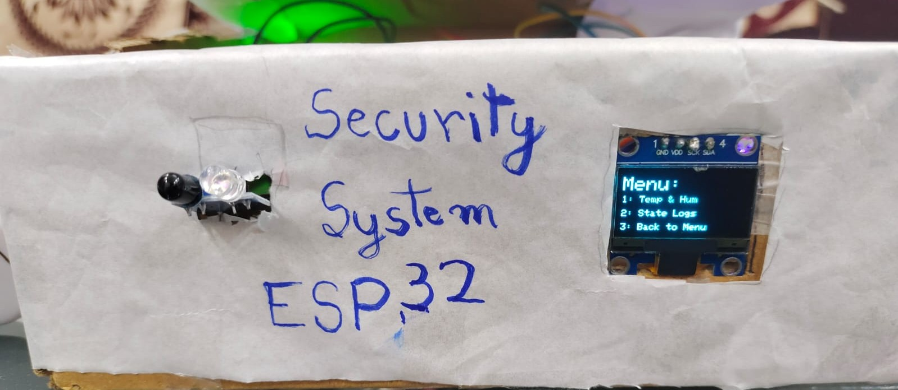
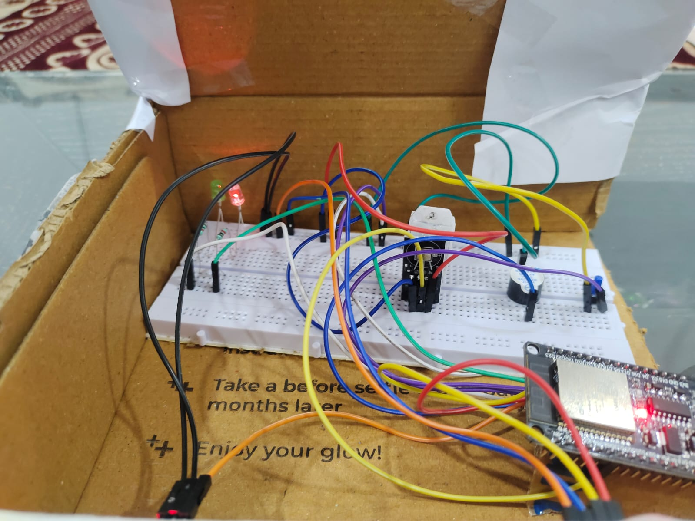
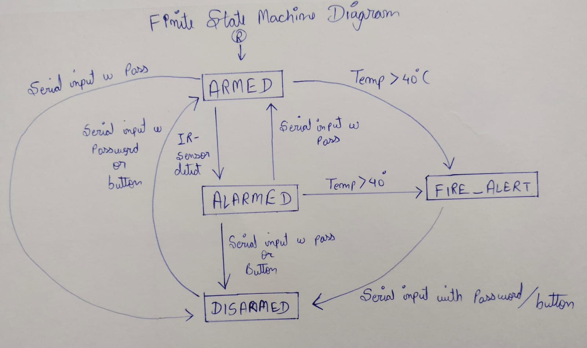
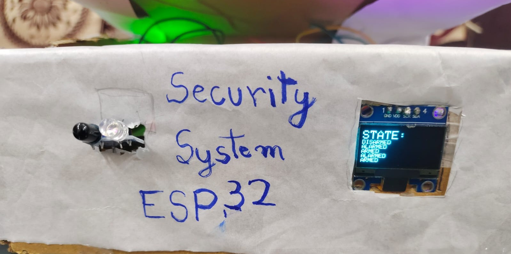

# esp32-Security-System
# OVERVIEW

[Demo Video](images/demo1.mp4)

A security system project built on ESP32 microcontroller.

This system uses an IR sensor that detects any motion in front of the system switching on an alarmed state. The system also used a DHT-22 sensor that displays temperature and humidity; and switches to an emergency state when triggered by temperatures over 40°C. 

This project is built as a part of my embedded systems learning journey and includes special structure built on linked list and queue to display event logs.

# FEATURES
- Motion detection using IR sensors.
- Temperature and humidity monitoring using DHT-22.
- Mini OLED Display.
- Alarm state management using a finite state machine.
- Emergency state for exceedingly high temperature.
- Buzzer alarm.
- LED of green to indicate safe state and blinking red led to indicate alarmed state
- Password protected state of ARM and DISARM through serial monitor.
- Killswitch button that turns the alarm off in case of false alarms.
- Event logging with queue built on linked list to show the last 5 events of the system.
- Menu based OLED interface taking input from serial monitor.

# HARDWARE USED
- ESP32 Dev Module.
- Red and Green LED.
- Buzzer.
- Push Button.
- OLED Display 0.96 SSD1306.
- DHT22 (temperature and humidity) sensor.
- IR (obstacle detection) sensor.
- Breadboard and Jumper Wires.

# SOFTWARE USED
- Arduino IDE (C/C++)
- State Machine
- Linked List
- Queue
- Struct
- Enum
- Pointers
- Dynamic memory allocation
- I2C communication
- Serial communication

# System States
# ARMED
The system is looking for triggers for alarm by IR sensor or increasing temperature, this state can only be activated by the password written in serial monitor and the killswitch push button.
# ALARMED
The system has found an intruder from the IR sensor motion detection, the buzzer will start to buzz and the red led will start blinking.
# DISARMED
The system has been disarmed, the sensors are put to rest and cannot change the state unless armed again, this state can only be activated by the password written in serial monitor and the killswitch push button.
# FIRE_ALERT
The system is in exceedingly high temperature aka rajasthan's hot summer of 40°C. The system will behave like alarmed state untill turned off.

# Event Logging
Event logs are manages in a queue made using a linked list with max 5 length such that it keeps on queueing new state and removing the old state.

Example has been given in the 
 

STATES: 
ARMED
DISARMED
ALARMED
ARMED
ALARMED

# Data Structures Used
A queue was implemented using:
- Linked list
- Dynamic memory allocation
- Enums
- Structs

# What I Learned

- Finite State Machines
- I2C Communication
- OLED Display Interfacing
- Dynamic Memory Allocation
- Linked Lists
- Queue Data Structures
- Sensor Integration
- Embedded Debugging
- Serial Communication

[Video demo of Menu on the OLED Display](images/demo_menu.mp4)

# Author
Suhaan Tanveer

BTech Electronics and Communication Engineer

Manipal University Jaipur
